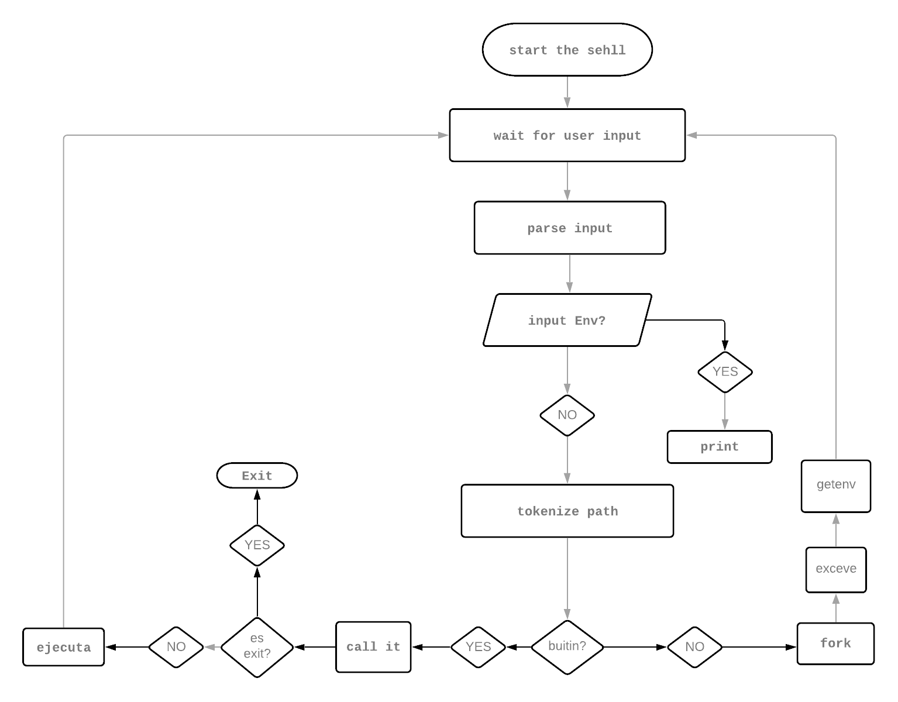

Simple Shell
Release date August 8, 2022
commit_activity contributors code-size Documentation
Table of Contents
Introduction
What is Shell
What is it for
Project Information
Tasks
Enviroment
General requirements
Allowed functions
Documentation
Instalation
Testing
Files
Flowchart
Authors
Introduction
What is Shell
A shell is a command-line interpreter, it is the computer program that provides a user interface to access the services of the operating system. Depending on the type of interface they use, shells can be of various types, in this case, a shell program of the type sh (Bourne Shell) will be developed. Users typically interact with a shell using a terminal emulator that is used for entering data into and displaying or printing data from, a computer or a computing system.

What is it for
This consists of interpreting orders. It incorporates features such as process control, input/output redirection, law listing and reading, protection, communications, and a command language for writing batch programs or scripts. All Unix-type systems have at least one interpreter compatible with the Bourne shell. The Bourne shell program is found within the Unix file hierarchy at /bin/sh.

Project Information
Tasks
Task 0. README, man_1_simple_shell, AUTHORS
Task 1. Betty would be proud
Task 2. Simple shell 0.1
Task 3. Simple shell 0.2
Task 4. Simple shell 0.3
Task 5. Simple shell 0.4
Task 6. Simple shell 1.0
Task 7. What happens when you type ls -l in the shell
Enviroment
Suite CRM OS: Ubuntu 20.04 LTS

terminal

C Low level programming language Language: C Compiler: gcc 9.3.0

Suite CRM Editor: VIM 8.1.2269

git distributed version control system Control version: Git

Github

Style guidelines: Betty style

General requirements
Allowed editors: vi, vim, emacs
All your files will be compiled on Ubuntu 14.04 LTS
Your C programs and functions will be compiled with gcc 4.8.4 using the flags -Wall -Werror -Wextra and -pedantic
Your code should use the Betty style. It will be checked using betty-style.pl and betty-doc.pl
No more than 5 functions per file
All your header files should be include guarded
This shell should not have any memory leaks
Unless specified otherwise, your program must have the exact same output as sh (/bin/sh) as well as the exact same error output.
Allowed functions used
execve (man 2 execve)
exit (man 3 exit)
_exit (man 2 _exit)
fork (man 2 fork)
free (man 3 free)
getline (man 3 getline)
isatty (man 3 isatty)
malloc (man 3 malloc)
perror(man 3 perror)
signal (man 2 signal)
stat (__ xstat) (man 2 stat)
strtok (man 3 strtok)
wait (man 2 wait)
write (man 2 write)
Documentation
Installation
Clone this repository: git clone "https://github.com/giddykeyz/simple_shell"
Change directories into the repository: cd simple_shell
Compile: gcc -Wall -Werror -Wextra -pedantic *.c -o hsh
Run the shell in interactive mode: ./hsh
Or run the shell in non-interactive mode: example echo "Hello world!" | ./hsh
Testing
First compile and then run the executable file on your terminal For compile see Installation section

$ ./hsh
$
$ ls -l
total 56
-rw-r--r-- 1 root root  238 Dec  6 08:34 AUTHORS
-rwxr-xr-x 1 root root  393 Dec  6 08:39 generate-authors.sh
-rw-r--r-- 1 root root 2263 Dec  6 08:39 hsh_execute.c
-rw-r--r-- 1 root root  263 Dec  6 08:39 hsh_getenv.c
-rw-r--r-- 1 root root  341 Dec  6 08:39 hsh_getline_command.c
-rw-r--r-- 1 root root  580 Dec  6 08:39 hsh_get_path.c
-rw-r--r-- 1 root root 1160 Dec  6 08:39 hsh_shell.c
-rw-r--r-- 1 root root 1475 Dec  6 08:39 hsh_string_foos.c
-rw-r--r-- 1 root root  695 Dec  6 08:39 hsh_tokenizer.c
-rw-r--r-- 1 root root 1066 Dec  6 08:39 hsh_values_path.c
drwxr-xr-x 2 root root   37 Dec  6 08:34 img
-rw-r--r-- 1 root root 1461 Dec  6 08:34 man_1_simple_shell
-rw-r--r-- 1 root root 7134 Dec  6 08:34 README.md
-rw-r--r-- 1 root root  824 Dec  6 08:39 shell.h
Files
File	Description
AUTHORS	Contributors in this repository
README.md	Information about our repository
hsh_execute	Execute builtins and commands
hsh_get_path.c	Get variable PATH
hsh_getenv.c	Prints enviroment to stndard output
hsh_getline_command.c	Gets input
hsh_shell.c	Main arguments functions
hsh_tokenizer.c	Tokenizes a stirng
man_1_simple_shell	Manual page our of Simple Shell
shell.h	Prototypes functions and headers
Flowchart
image

Authors
Bardi Gideon - giddykeyz
Joy Oboh - Backendjoy
## Flowchart

## Authors

<li> Bardi Gideon - <a href="https://github.com/giddykeyz">giddykeyz</a></li>
<li> Joy Oboh - <a href="https://github.com/Backendjoy">Backendjoy</a></li>
